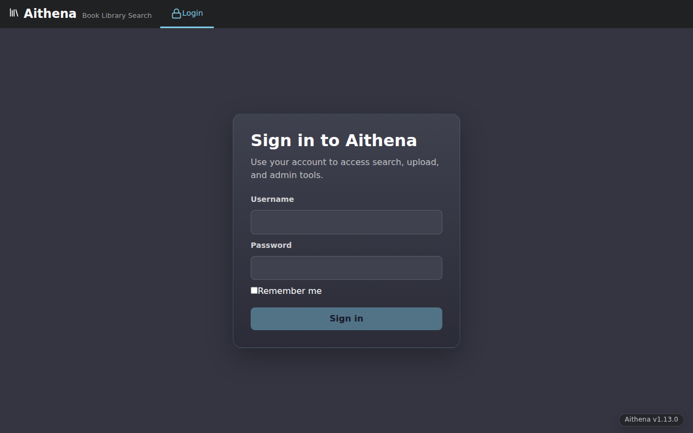
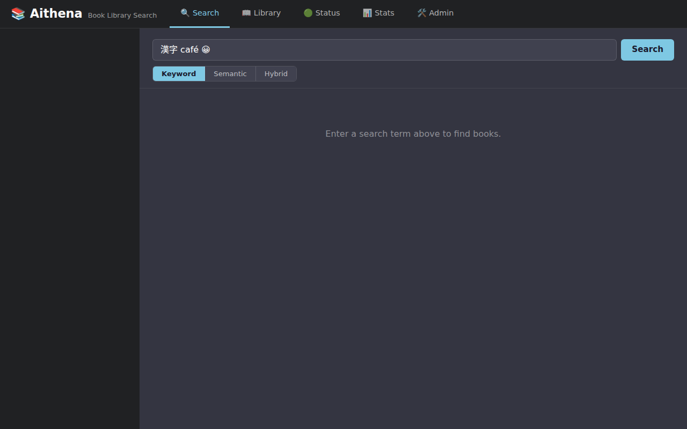
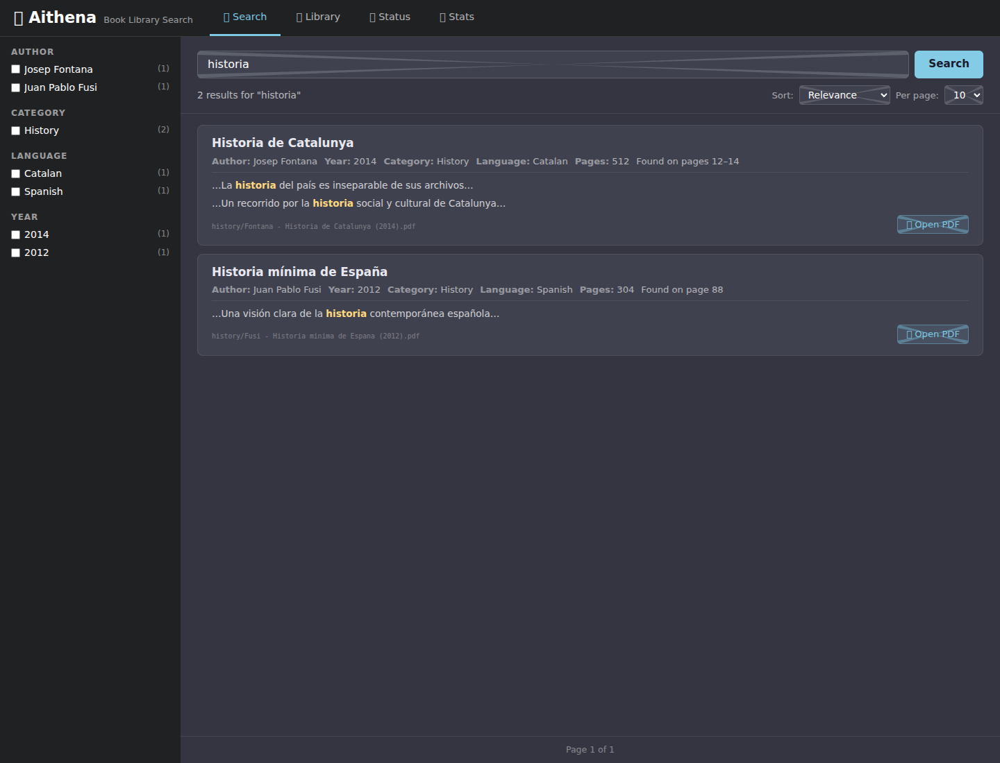
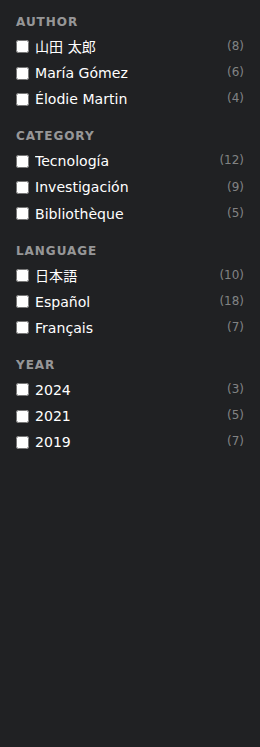
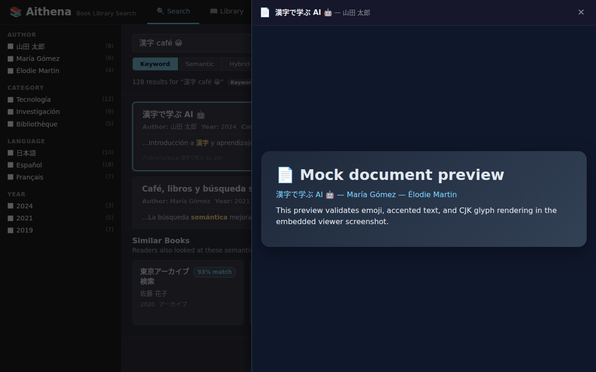
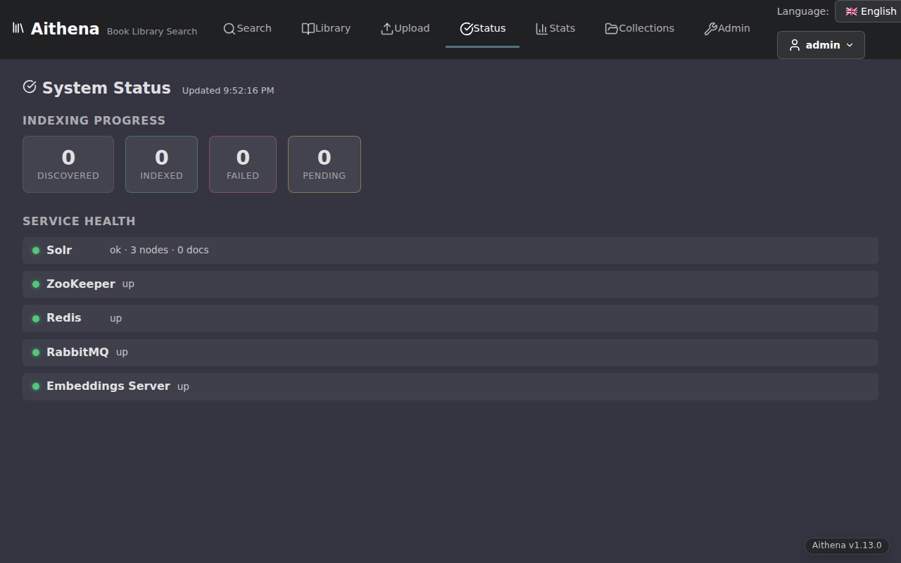
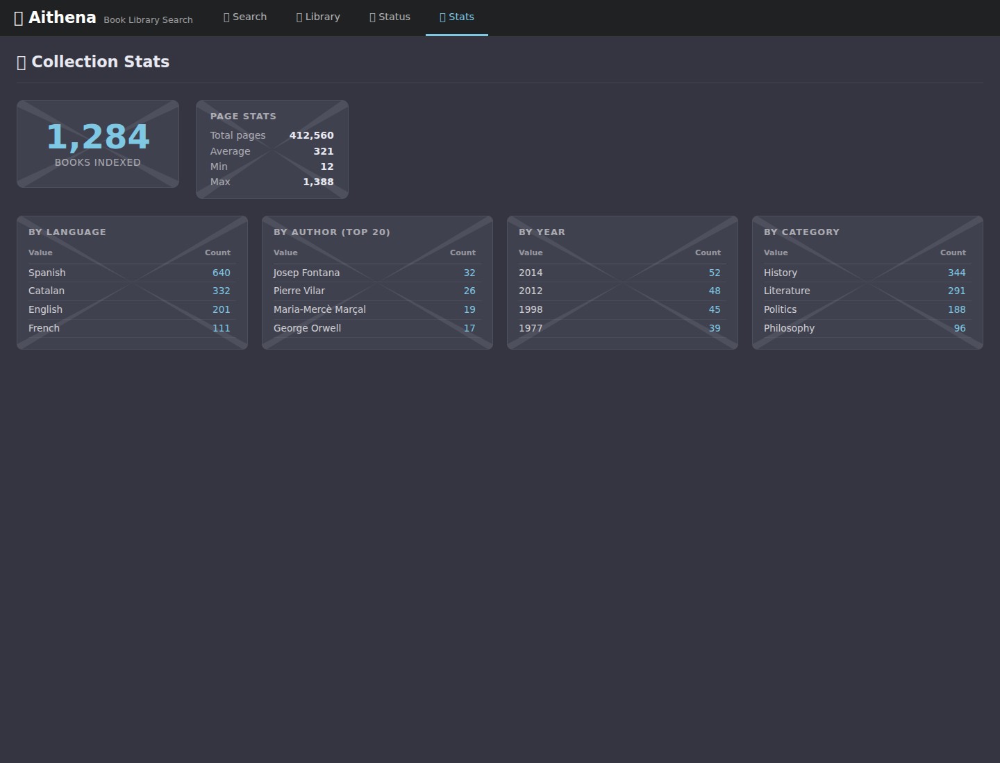
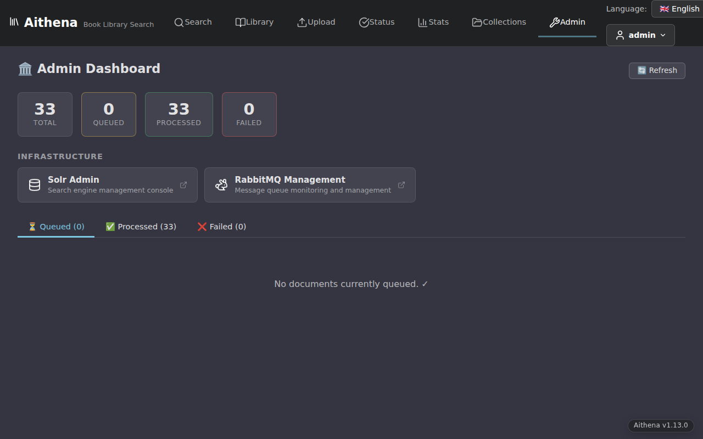
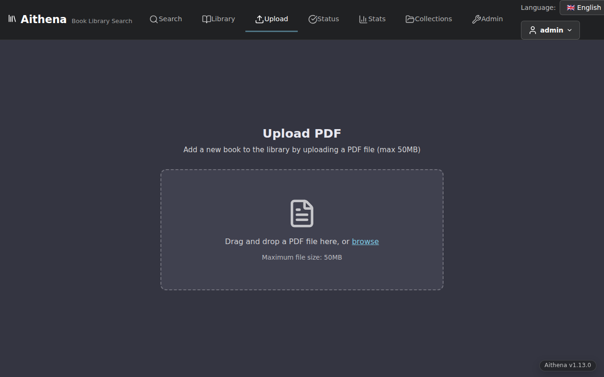

# User Manual

This manual explains how to use Aithena as a reader or library user. For setup, deployment, and service troubleshooting, see the [Admin Manual](admin-manual.md). For the latest release features, see the [latest changelog](../CHANGELOG.md).

**v1.16.0 fixes search experience:** semantic search results now use the same display style as keyword results, keyword match context is truncated to 40 words, page numbers are restored for keyword matches, and thumbnails are now shown for all search modes. See [Search (v1.16.0 fixes)](#searching-for-books) below.

**v1.15.0 introduces admin portal improvements:** redesigned sidebar navigation for the admin dashboard, per-service log viewer for inspecting container logs, detailed indexing status, and SSO passthrough for Solr admin access. See [Admin Portal (v1.15.0+)](#admin-portal-v1150) below.

**v1.9.0 introduces account management and role-based access control.** Users can now manage their own passwords, and access is enforced by role (admin, user, viewer). See [Your Account & Permissions](#your-account--permissions) below.

**v1.10.0 introduces Collections** — personal reading lists where you can organize, annotate, and revisit documents. See [Collections](#collections-v1100) below.

**v1.11.0 introduces richer book discovery:** search results now show chunk text previews with page ranges, book cards open a detailed view with richer metadata and similar books, the PDF viewer toolbar now includes fullscreen and download actions, and both search and library views show document thumbnails.

**v1.12.1 refines UX:** collections now use real backend data by default, login form adds "Remember me" checkbox for session persistence, search result text previews are truncated for improved readability, and thumbnail generation is fixed in Alpine containers.

**v1.13.0 improves offline deployment and search:** air-gapped offline installer package for disconnected environments, diacritic-insensitive search by default (matches "café" when searching "cafe"), and comprehensive infrastructure security hardening. See [Diacritic-Insensitive Search](#diacritic-insensitive-search-v1130) below.

**v1.15.0 adds admin portal enhancements:** sidebar navigation, per-service log viewer, detailed indexing status, and SSO for Solr admin. See [Admin Portal (v1.15.0+)](#admin-portal-v1150) below.

**v1.17.0 adds GPU acceleration for embeddings:** optional GPU support speeds up document indexing 2–4× on NVIDIA GPUs and 1.5–2× on Intel GPUs. GPU is opt-in via environment variables; CPU-only deployments are unaffected. See [GPU Acceleration](#gpu-acceleration-v1170) below.

**v1.18.0 adds folder path facets for hierarchical search filtering:** new "📁 Folder" facet in the search sidebar lets you filter by document location in the library structure. Collections now display books using the same card/list components as the Library, creating a consistent reading experience. See [Folder Facets (v1.18.0)](#folder-facets-v1180) below.

**v1.18.1 patch:** Fixes the installer `ModuleNotFoundError` when running `uv run installer/setup.py` from the repo root (now works from any directory). See [v1.18.1 Release Notes](release-notes/v1.18.1.md).

## Getting started

Aithena is a web app for searching an indexed PDF library. It helps you:

- sign in with the account created during installation (v0.11.0+)
- search by keyword, semantic meaning, or a hybrid of both
- see chunk text previews with page ranges in search results (v1.11.0+)
- narrow results with facets including language, author, year, category, and folder location (v1.18.0+)
- view document thumbnails in search and library results (v1.11.0+; all search modes v1.16.0+)
- click a result to open a richer book detail view with metadata and similar books (v1.11.0+)
- open PDFs directly from search results with page-level navigation from keyword matches (v1.11.0+; page links restored v1.16.0+)
- use Similar Books recommendations from the book detail view or PDF viewer (v1.11.0+)
- upload PDF files via drag-and-drop (v0.6.0+)
- organize documents into personal collections with notes (v1.10.0+)
- check the Aithena version in the footer (v0.7.0+)
- check system health in the Status tab
- view library-wide statistics in the Stats tab
- open the Admin tab to load the embedded operator dashboard when you need admin tools

### How to access it

Most users will open Aithena through the main web address provided by their administrator.

In a local Docker Compose setup, the main entry point is usually:

- `http://localhost/`

If you are running the frontend in Vite development mode instead of the full stack, the UI may also be available on:

- `http://localhost:5173`

With the v0.11.0 auth flow enabled, visiting protected pages redirects you to `/login` until you sign in successfully.

### Sign in (v0.11.0+)

1. Open the main Aithena URL.
2. Enter the username and password created by the installer.
3. **(Optional, v1.12.1+)** Check the "Remember me" box if you want to stay logged in even after closing the browser. Leave unchecked for a session-only login that expires when you close the browser.
4. Submit the login form.
5. After login, Aithena keeps your browser session active and automatically attaches auth to protected requests until you log out or the session expires.



<!-- TODO: capture screenshot -->

### Reset your password

If you forget your password, an administrator can reset it using the CLI tool:

```bash
# From the project root — generates a new random password and prints it
cd src/solr-search
uv run python reset_password.py --db-path /data/auth/users.db

# Or set a specific password
uv run python reset_password.py --db-path /data/auth/users.db --password "your-new-password"

# Reset a specific user (default is "admin")
uv run python reset_password.py --db-path /data/auth/users.db --username myuser --password "new-pass"
```

On a local dev machine, the database is typically at `~/.local/share/aithena/auth/users.db`. In Docker, it's at `/data/auth/users.db` inside the `solr-search` container.

To reset the password inside a running container:

```bash
docker compose exec solr-search python reset_password.py
```

The tool generates a secure 32-character random password if `--password` is omitted, and prints it to stdout.


## Your Account & Permissions

*New in v1.9.0:* Users can now manage their own accounts with self-service password changes and profile viewing. Access to library features depends on your role.

### Manage your password (v1.9.0+)

You can change your password at any time:

1. Open the **Profile** page by clicking your username in the top navigation profile menu or navigating to `/profile`
2. Enter your current password to verify your identity
3. Enter a new password that meets the **strong password policy**:
   - **At least 10 characters** (increased from 8 in earlier versions)
   - **At least 3 of the 4 complexity categories:**
     - Uppercase letters (A–Z)
     - Lowercase letters (a–z)
     - Digits (0–9)
     - Special characters (!@#$%^&* etc.)
   - **Cannot contain your username**
4. Confirm the new password by re-entering it
5. Click **Update Password** to save

Verify your password meets the policy requirements after entry.

### View your profile (v1.9.0+)

1. Click your username in the top navigation profile menu or navigate to `/profile`
2. View your account details:
   - **Username** — your login name
   - **Role** — your access level in the system (see table below)
   - **Created** — when your account was created
3. Use the **Change Password** form to update your password (see above)

### Understanding roles and permissions (v1.9.0+)

Aithena uses three roles to control what you can do:

| Role | Can Search | Can Upload | Can View Profile | Can Manage Users | Library Limits |
|------|-----------|-----------|------------------|-----------------|----------------|
| **admin** | ✅ Yes | ✅ Yes | ✅ Yes | ✅ Yes (full CRUD) | None |
| **user** | ✅ Yes | ✅ Yes | ✅ Yes | ❌ No | None |
| **viewer** | ✅ Yes (read-only) | ❌ No | ✅ Yes | ❌ No | Search only |

**What this means:**
- **Admin** users can create, edit, and delete other user accounts, in addition to full search and upload capabilities
- **User** (standard) role is suitable for day-to-day library access — search, upload PDFs, and manage your own password
- **Viewer** role is for read-only access — you can search the library but cannot upload documents or manage users

If your role is more restrictive than you expect, contact your administrator to request role changes.

### Login rate limiting

If you enter your password incorrectly **5 or more times within 60 seconds**, the system will reject further login attempts from your IP address for that window. If you exceed the limit, wait a moment and try again.

If you suspect your account has been compromised, contact your administrator to reset your password.

## Searching for books

The **Search** tab is the main place to work.

*New in v1.8.1:* All text on this page, including labels, buttons, and placeholders, is now fully translated. The page automatically displays in your selected language.



### Run a search

1. Open **Search**.
2. Enter one or more keywords.
3. Pick a search mode if you want something other than the default.
4. Click **Search**.

### Search modes

Use the mode buttons beside the search box to switch between:

- **Keyword** — best for exact words, known titles, author names, and traditional full-text lookup.
- **Semantic** — best when you want books that are conceptually related to a phrase or topic, even if they do not share the exact same wording.
- **Hybrid** — combines both approaches and is usually the best starting point when you want broad discovery with some precision.

Important behavior in the shipped UI:

- **Keyword** is the default mode when the page opens.
- Switching modes keeps your current query but resets results back to page 1.
- The current mode is shown again next to the result count as a badge.
- Semantic and hybrid search require a real query. If embeddings are not ready yet, the page shows an inline error instead of silently failing.

### Diacritic-Insensitive Search (v1.13.0+)

*New in v1.13.0:* By default, Aithena ignores accents (diacritics) when searching. This means:

- Searching for **"cafe"** finds results with "café", "cafè", and "cafes" (all accent variants)
- Searching for **"naive"** matches "naïve", "naïf", and other variants
- Searching for **"Jose"** finds "José", "Josè", and "Jose"
- Wildcard searches like `*tion` also respect diacritic folding and match "acción", "action", "ación", etc.

**Why this matters:** Diacritics are often missing or inconsistent in OCR text or manual cataloging. Diacritic-insensitive search helps you find documents even when accents are inconsistent.

**If you need exact accent matching:** Contact your administrator. Per-index diacritic sensitivity can be configured in the admin manual if your library requires it.

### What your keywords can match

The current search implementation is built to match against indexed book data, including:

- title
- author
- full PDF text

This makes Aithena useful both for known-item searches such as an author or title and for text discovery inside the book content.

### Understand the results list

Each result card may show:

- title
- author
- year
- category
- language
- page count
- document thumbnail (v1.11.0+, fixed in v1.12.1) — lazy-loaded image preview
- matching text snippets and page ranges (v1.11.0+), truncated for readability (v1.12.1+)
- file path

If the search engine knows which pages matched, the result also shows a page label such as:

- **Found on page 12**
- **Found on pages 12–14**

For semantic and hybrid searches, the result displays **chunk text previews** — the exact matching passages from the document with page numbers. This helps you decide whether to open the book without reading the full PDF.

Hover over a result card to see the thumbnail preview more clearly. On slower connections, thumbnails load a moment after the search results appear.

### Sort and paging controls

After you search, you can change:

- **Sort**: relevance, year, title, or author
- **Per page**: 10, 20, or 50 results
- **Pagination**: move between result pages with the controls at the bottom

### Shareable search links (v1.3.0+)

Your current search, including filters, sort order, and page number, is automatically encoded in the URL. This makes it easy to share results with colleagues.

#### How to share a search

1. Run a search with your filters, sort, and page selection exactly as you want them.
2. Copy the URL from your browser's address bar.
3. Send the URL to a colleague via email, chat, or any messaging tool.
4. When they open the link, they'll see the exact same filtered results without re-running the search.

#### Browser history

- Use your browser's **back** button to return to a previous search.
- Use your browser's **forward** button to move forward through your search history.
- Each change to filters, sort order, or page number is tracked in the browser history, so you can step through your search workflow.

#### What gets saved in the URL

The URL encodes:

- your search query
- all active filters (language, author, year, category)
- sort order (relevance, year, title, author)
- current page number
- results per page (10, 20, or 50)



Facet filters appear in the left sidebar.

### Available facets

You can filter by:

- **Language**
- **Author**
- **Year**
- **Category**
- **Folder** (v1.18.0+)

### How to use them

- Click a facet value to apply it.
- Combine values across different facet groups.
- Review active filters above the search results.
- Remove a single filter from its chip.
- Use **Clear all** when multiple filters are active.

### What to expect

- Counts next to each facet show how many matching books are in that bucket.
- Changing a filter refreshes the results immediately.
- When you change a filter, the result list returns to page 1.

## Folder Facets (v1.18.0+)

The **Folder** facet helps you organize and filter searches by the location of documents in your library structure. This is especially useful for large libraries organized by topic, language, or author.

### How folder filtering works

1. In the search sidebar, look for the **📁 Folder** facet (new in v1.18.0)
2. Click on a folder name to filter results to documents in that folder
3. The filter automatically includes documents in all subfolders (recursive filtering)
4. Combine folder filters with other facets (language, author, etc.) for more precise searches
5. View your active filters in the "Active Filters" section above the results
6. Remove a folder filter by clicking the ✕ on its filter chip

### Example workflows

**Scenario 1: Narrow by language**
- Click "📁 Folder" → "English" to see all books in the English section
- Results automatically include "English/History", "English/Science", etc.

**Scenario 2: Combine with other filters**
- Click "📁 Folder" → "English" → "Science Fiction"
- Then click **Year**: "2020–2025"
- Result: Science Fiction books in English published in the last 5 years

**Scenario 3: Explore library organization**
- Expand the folder tree to see how your library is organized
- Use folder filtering to discover sections you might not have known existed

### Folder filter behavior

- **Hierarchical:** Clicking a parent folder shows all documents in that folder and all subfolders
- **Counts:** The number next to each folder shows how many documents are in that folder (including subfolders)
- **Multi-select:** You can click multiple folder names to search across different sections
- **Combinable:** Folder filters work alongside language, author, year, and category filters



## Viewing PDFs

When a result includes an attached document link, you can open the PDF directly from the result card or the book detail view.

*New in v1.8.1:* All text on this page, including labels and buttons, is now fully translated to your selected language.

*Updated in v1.11.0:* The PDF viewer toolbar now includes additional actions.

### Open a PDF

1. Run a search.
2. Find the result you want and click on the result card to open the **Book Detail View**.
3. In the detail view, click **📄 Open PDF** to view the document.

Alternatively, you can click the **📄 Open PDF** button directly on a search result card to open the PDF overlay without the detail view first.

The document opens in an overlay viewer without leaving the search page.



### PDF viewer toolbar (v1.11.0+)

The PDF viewer toolbar (top-right of the viewer) includes these actions:

- **Fullscreen** — expand the PDF to fill your entire screen for focused reading
- **Download** — save the PDF file to your computer
- **Open in new window** — open the PDF in a separate browser tab for side-by-side viewing or independent use
- **Close** — close the viewer and return to the search results

### Page navigation from search results

If the search result includes matched page information, Aithena opens the PDF on the first matching page automatically. This is useful when you searched for a term that appears deep inside a long document.

### Close the viewer

You can close the PDF overlay by:

- clicking the **✕** or **Close** button in the toolbar
- pressing **Escape** on your keyboard

### If a PDF does not load

If the embedded viewer cannot display the file, Aithena shows a fallback link so you can try opening the PDF in a new browser tab.

## Finding similar books

The **Similar Books** panel helps you discover related documents. You can access it from the book detail view or from the PDF viewer.

### Where to find it

**Option 1: From the book detail view (recommended)**
1. Run any search.
2. Click on a result card to open the **Book Detail View**.
3. Scroll down in the detail panel to see the **Similar Books** section.

**Option 2: From the PDF viewer**
1. Run any search.
2. Click **📄 Open PDF** on a result.
3. Look below the search results area for the **Similar Books** panel.

*New in v1.11.0:* Similar Books is now decoupled from the PDF viewer and remains fully functional in the book detail view, making it easier to explore related titles without opening a PDF.

### How it works

- The panel loads up to **5** semantically related books for the document you just opened.
- Each card shows the title, author, optional year/category, optional thumbnail preview, and a rounded match score such as **91% match**.
- While the request is running, the page shows loading text and placeholder cards.
- If no recommendations are available, the panel says **No similar books found**.
- If the request fails, the page shows a friendly message instead of breaking the rest of the search UI.

### How to use recommendations

Click any similar-book card to navigate to that book's detail view or to replace the currently selected PDF with that recommendation. This makes it easy to explore related titles without starting a new search from scratch.

<!-- TODO: capture similar-books.png screenshot when library has indexed data -->

## Book Detail View (v1.11.0+)

When you click on a search result card, Aithena opens a **Book Detail View** modal showing comprehensive information about the document.

### What the detail view shows

The detail view displays:

- **Title and metadata** — full document title, author, year, category, language
- **Thumbnail preview** — high-quality document cover or first page image (lazy-loaded)
- **Document summary** — page count, file size, and location path
- **Collections status** — which of your personal collections contain this document, with a quick "Add to collection" button
- **Similar Books section** — up to 5 related documents with match scores (see [Finding similar books](#finding-similar-books))
- **PDF viewer link** — click **📄 View PDF** to open the full document in the overlay viewer

### Admin features in the detail view (Admin only)

If you are an admin user, the detail view also includes:

- **Edit metadata button** — click **Edit** to modify the book's title, author, year, category, or series inline
- **Inline editing** — save changes instantly; changes appear immediately across the search interface

Regular users will not see the edit option in the detail view.

### Navigating the detail view

- Click anywhere outside the detail view to close it and return to search results
- Press **Escape** to close the detail view
- Use the browser back button to return to your previous search

## Understanding the Status tab

The **Status** tab is a quick health dashboard.

### Indexing Progress

This section shows:

- **Discovered** — books found by the scanner
- **Indexed** — books processed successfully
- **Failed** — books that did not index successfully
- **Pending** — books still waiting or still being processed

### Service Health

This section shows whether key services are reachable:

- **Solr** — search engine health, node count, and indexed document count
- **ZooKeeper** — coordination service for search nodes
- **RabbitMQ** — queue service used by the ingestion pipeline
- **Redis** — indexing state store
- **embeddings-server** — semantic search backend

*New in v1.8.1:* The Status tab now reports all critical services, including previously missing services like ZooKeeper and embeddings-server.

### Auto-refresh

The Status tab refreshes automatically every **10 seconds**, so it is the best place to watch the system during imports or after operational changes.



## Understanding the Stats tab

The **Stats** tab gives a library-wide summary.

### Summary cards

You can see:

- total books indexed
- total pages
- average pages per book
- smallest indexed book by page count
- largest indexed book by page count

### Accurate book count (v1.4.0+)

Starting with v1.4.0, the **total books indexed** count reflects the actual number of books in your library. Earlier versions counted indexed chunks or pages, which could be much higher than the unique book count. Now the count is precise and useful for library metrics.

### Breakdown tables

The page also shows counts grouped by:

- language
- author
- year
- category

### Refresh behavior

The Stats tab loads when you open it. If new books have been indexed since the page was opened, refresh the browser page to load the latest totals.



## Using the Admin tab

The **🛠️ Admin** tab opens an embedded operator dashboard inside the Aithena app.

### What it shows

The embedded Streamlit dashboard currently includes:

- **Total Documents**, **Queued**, **Processed**, and **Failed** counters
- **RabbitMQ Queue** metrics for ready, unacknowledged, and total messages
- sidebar access to **Document Manager**, where operators can inspect queued, processed, and failed documents and trigger requeue or clear actions

### What to expect

- The Admin tab loads `/admin/` inside the app rather than sending you to a different product.
- It is mainly intended for operators and library administrators, not day-to-day readers.
- The admin dashboard now requires an authenticated session; if your session expires, Aithena redirects you back to `/login`.
- If the dashboard cannot load after you sign in, contact your administrator to confirm the admin services are running and your account has been provisioned correctly.

*New in v1.8.1:* The admin dashboard login issue has been fixed. You should now be able to access it without being stuck in a login loop.



<!-- TODO: capture screenshot -->


## Uploading PDFs (v0.6.0+)

The **Upload** tab lets authenticated users add PDFs to the library without direct server access.

### How to upload

1. Open the **Upload** tab.
2. Either drag-and-drop a PDF onto the zone, or click to browse and select a file.
3. Watch the real-time progress bar as the file transfers.
4. When the upload completes, you'll see a success message.



<!-- TODO: capture screenshot -->

### What happens after upload

- Your PDF is placed in the library staging area.
- The indexer picks it up on the next scan cycle (usually within seconds to minutes depending on queue size).
- Once indexed, the document appears in search results.
- If indexing fails, check the Admin tab to see failed documents.

*New in v1.8.1:* The Upload page now displays all instructions and status messages in your selected language. No more English-only UI text.

### Upload limits

- **File size**: Maximum 50 MB per file (contact your administrator to change this)
- **File type**: PDF only
- **Rate limit**: 10 uploads per minute per IP address

### Troubleshooting uploads

| Error | What it means | How to fix |
|---|---|---|
| "Invalid file type. Please upload a PDF." | You selected a non-PDF file | Select a file ending in `.pdf` |
| "File is too large. Maximum size is 50 MB." | Your PDF exceeds the size limit | Split the PDF or contact your administrator |
| "Too many uploads. Please wait a moment and try again." | You've hit the rate limit | Wait a minute and try again |
| "Upload failed. Please try again." | Server error during upload | Try again; if it persists, contact your administrator |

## Collections (v1.10.0+)

*Updated in v1.12.1:* Collections now use real backend data by default, with persistent storage and full CRUD support.

*Updated in v1.18.0:* Collections now display books using the same card/list components as the Library, creating a consistent visual style with title, author, thumbnails, and Open PDF buttons.

Collections let you organize, annotate, and revisit documents you find interesting. Think of them as personal reading lists within Aithena.

### Creating a collection

1. Open the **Collections** tab from the main navigation.
2. Click the **New Collection** button.
3. Enter a name (required, up to 200 characters) and an optional description.
4. Click **Create**.

Your new collection appears in the grid immediately.

### Browsing your collections

The collections page shows all your collections as a card grid. Each card displays:

- The collection name and description
- How many items it contains
- When it was last updated

Click a card to open the collection detail view.

### Adding documents to a collection

From search results, each book card has an **Add to Collection** button. Click it to open the collection picker:

1. Search for books as usual.
2. On a result card, click the collection picker toggle.
3. Select a collection from the dropdown (you can search by name).
4. The document is added to the collection instantly.

### Viewing collection details

The detail page shows all items in a collection with:

- Document title, author, and year
- A note area for each item
- Sort controls (newest first, title A–Z, author A–Z, year, etc.)
- Edit and Delete buttons for the collection itself

### Taking notes on items

Each item in a collection has a note field. Type your notes directly — they auto-save after a brief pause (about 1 second). A "Saving…" indicator appears while the note is being saved.

Notes are great for recording why you added a document, key takeaways, or page references.

### Editing a collection

1. Open the collection detail page.
2. Click the **Edit** button.
3. Change the name or description.
4. Click **Save**.

### Deleting a collection

1. Open the collection detail page.
2. Click the **Delete** button.
3. Confirm the deletion in the dialog.

> **Warning:** Deleting a collection permanently removes all its items and notes. This action cannot be undone.

### Removing items from a collection

1. In the collection detail view, find the item you want to remove.
2. Click the **Remove** button on the item card.
3. Click **Confirm** to complete the removal.

The two-step confirmation prevents accidental removals.

### Collection badges on search results

When you search for books, results that belong to one of your collections display a small badge. This helps you quickly see which documents you've already organized.

### Tips

- Use descriptive collection names so you can find them quickly.
- The sort dropdown is useful for large collections — try sorting by title or author.
- Notes support plain text only (no formatting).

## Editing book metadata (Admin only, v1.10.0+)

If you have admin privileges, you can correct or enhance book metadata (title, author, year, series/collection name, and category) for one book or many books at once.

### Edit a single book

**Option 1: From the book detail view (v1.11.0+, recommended)**

1. Click a search result card to open the **Book Detail View**.
2. Click the **Edit** button in the detail view.
3. In the inline editor that appears, modify the fields you want to change:
   - **Title** — The book title (max 255 characters)
   - **Author** — Author name (max 255 characters)
   - **Year** — Publication year (must be between 1000 and 2099)
   - **Category** — Book category (e.g., "Science Fiction", "History")
   - **Series** — The series or magazine name (e.g., "Foundation", "Nature Magazine")
4. Changes save automatically as you type.
5. Close the detail view to apply the changes.

**Option 2: From the search result menu**

1. From search results, click the **⋮** menu on a book card.
2. Select **Edit metadata**.
3. In the modal that appears, modify the fields you want to change (see option 1 for field descriptions).
4. Click **Save**.

The metadata updates immediately in Solr search, and you'll see the changes reflected in search results right away.

### Edit multiple books at once (Batch editing)

When you need to update metadata for many books (e.g., all books in a folder):

1. **Filter and select**: 
   - Use the folder facet or other filters to narrow to the books you want to edit.
   - Toggle **Select mode** at the top of the search results (or long-press on mobile).
   - Checkboxes appear on each result; check the boxes for the books you want to update.
   - Use **Select All** to select all results on the current page.

2. **Open the batch editor**:
   - A floating action bar appears at the bottom showing "Edit N books".
   - Click **Edit selected**.

3. **Configure changes**:
   - In the batch editor panel, only fill in the fields you want to change.
   - Empty fields mean "don't change this" — useful when updating only the year or series.
   - Each field has a checkbox. Only checked fields will be updated.
   - Look at the **Preview** section to confirm which fields will change and how many books will be affected.

4. **Apply**:
   - Click **Apply** to update all selected books.
   - Aithena will show progress and a summary when complete.

### Important notes about metadata editing

- **Persistence**: Manual metadata edits are saved even if a book is re-indexed. Aithena stores your changes and reapplies them automatically.
- **Audit trail**: Edits are attributed to the admin who made them (recorded with timestamp).
- **Series field (v1.10.0+)**: The new series field groups books into series (e.g., "Discworld"), magazines (e.g., "Scientific American"), or newspaper collections (e.g., "The Guardian"). You can then filter by series in the facet panel.
- **Batch limits**: Batch edits are limited to 1,000 documents per request to prevent accidental large-scale changes.

## Version information (v0.7.0+)

The Aithena version appears in the footer of the web app as a small version badge.

### What the version means

The version (e.g., **v1.11.0**) tells you which release you are running. This is useful when:

- **Troubleshooting:** Knowing the version helps you search documentation for known issues.
- **Feature confirmation:** New features appear only in specific versions (e.g., PDF upload in v0.6.0 and later, book detail view in v1.11.0 and later).
- **Support:** When contacting support, mention your version and the commit hash shown in the tooltip.

*New in v1.8.1:* The version now always matches the shipped release value, even after updates. Earlier versions sometimes showed stale version numbers.

*Fixed in v1.11.0:* The version display is now consistently accurate and reflects the version file on every visit.

### How to find the version

Hover over the version badge in the bottom-right corner of the footer to see:

- Full version number
- Git commit hash
- Build timestamp

If the version displays as "unknown", the admin dashboard may not be running or the version endpoint is unavailable.

## Admin Portal (v1.15.0+)

The admin portal has been redesigned with a sidebar navigation for easier access to admin tools. Administrators can access it at `/admin`.

### Sidebar Navigation

The admin portal now groups tools into a sidebar menu:

- **Dashboard** — overview of system status and quick actions
- **Indexing Status** — detailed per-document progress
- **Log Viewer** — per-service log streaming (see below)
- **Backups** — backup dashboard and restore wizard
- **Solr Admin** — embedded Solr admin UI with SSO passthrough

All existing admin routes continue to work; the sidebar provides a centralized way to navigate between them.

### Per-Service Log Viewer (v1.15.0+)

The log viewer lets administrators inspect container logs directly from the admin UI:

1. Open the admin portal at `/admin`
2. Select **Log Viewer** from the sidebar
3. Choose a service from the dropdown (e.g., `document-indexer`, `solr-search`, `nginx`)
4. View recent log output

This is useful for diagnosing indexing failures, auth issues, or service health problems without needing SSH access to the host.

### Solr Admin SSO (v1.15.0+)

Administrators no longer need separate Solr credentials to access the Solr admin UI. The admin portal injects BasicAuth credentials automatically when navigating to `/admin/solr/`. This single sign-on passthrough uses the credentials configured in the nginx proxy.

### Detailed Indexing Status (v1.15.0+)

The indexing status page now shows per-document indexing progress and status alignment with the system status view.

## GPU Acceleration (v1.17.0)

GPU acceleration is an optional feature that speeds up document indexing by offloading embedding generation to your GPU. This is most noticeable when indexing large libraries (10,000+ documents).

### Performance expectations

| Hardware | Improvement | Typical indexing time (50K docs) |
|----------|------------|----------------------------------|
| CPU only (default) | Baseline | 8–12 hours |
| NVIDIA GPU (RTX 3060+) | 2–4× faster | 2–4 hours |
| Intel GPU (Arc, iGPU via WSL2) | 1.5–2× faster | 4–6 hours |

### How to enable

GPU acceleration is controlled by two environment variables in your deployment:

| Variable | Values | Default | Description |
|----------|--------|---------|-------------|
| `DEVICE` | `auto`, `cpu`, `cuda`, `xpu` | `cpu` | Which compute device to use |
| `BACKEND` | `torch`, `openvino` | `torch` | Inference backend |

**For NVIDIA GPUs:**
```bash
# In your .env file or docker compose command
DEVICE=cuda
```
Then start with the NVIDIA override:
```bash
docker compose -f docker-compose.yml -f docker-compose.nvidia.override.yml up -d
```

**For Intel GPUs (including WSL2):**
```bash
DEVICE=xpu
BACKEND=openvino
```
Then start with the Intel override:
```bash
docker compose -f docker-compose.yml -f docker-compose.intel.override.yml up -d
```

**No GPU? No problem.** The default configuration (`DEVICE=cpu`, `BACKEND=torch`) works exactly as before — no changes needed.

### Prerequisites

- **NVIDIA:** NVIDIA drivers + [NVIDIA Container Toolkit](https://docs.nvidia.com/datacenter/cloud-native/container-toolkit/install-guide.html)
- **Intel:** Intel GPU drivers + `/dev/dxg` device accessible (see [Admin Manual](admin-manual.md) for WSL2 setup)

> **Note:** GPU acceleration only affects indexing speed. Search performance is unchanged — Solr handles search queries independently of the embedding hardware.

## Tips and tricks

- Start broad, then narrow with facets.
- Use author names or exact title words when you already know the book you want.
- Use uncommon phrases from the text when you are trying to rediscover a passage.
- If a result includes highlighted snippets, scan those before opening the PDF.
- Check the **Status** tab if new books are not appearing in search yet.
- Check the **Stats** tab when you want a quick sense of collection coverage by language, author, year, or category.
- Upload PDFs via the **Upload** tab if you don't have direct server access (v0.6.0+).
- Check the footer version badge to confirm you're running the latest release (v0.7.0+).

## Need more help?

- For deployment and troubleshooting: [Admin Manual](admin-manual.md)
- For release documentation and features: [v0.7.0 Feature Guide](features/v0.7.0.md)
- For previous releases: [v0.6.0 Feature Guide](features/v0.6.0.md), [v0.5.0 Feature Guide](features/v0.5.0.md)
